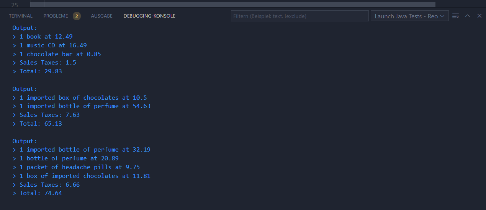

# SalesTaxes
## Table of contents
* [General info](#general-info)
* [What you need](#what-you-need)
* [Usage - VSCode](#usage-\--vscode)
* [Usage - Console](#usage-\--console)

## General info
In this project, the first problem "Sales Taxes" was solved using TDD. 
	
## What you need
To successfully run the project, you need following:
* Java >= 11 : https://www.oracle.com/java/technologies/downloads/
* Maven >= v3.8.1 : https://maven.apache.org/download.cgi
* VSCode : https://code.visualstudio.com/download

## Usage - VSCode
To run this project using VSCode, you need to do following steps:

1. Clone the project.
1. Open the project with VSCode.
1. In the src folder you will find the test folder. Open the file [ReceiptTest.java](https://github.com/sahob001/SalesTaxes/blob/main/src/test/java/Itemis/Salestaxes/ReceiptTests.java).
1. By right clicking on the file you will find the *Run Java* option. Click on *Run Java* to run the tests.
1. You can find the test output in the debugging console.
    

## Usage - Console
To run this project using console, you need to *cd* inside the project root and run following command: 
```
$  mvn clean test
```

